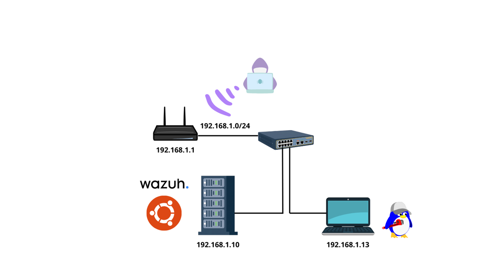

# 🖧 Network Description

Este laboratorio simula una red local orientada a la detección y monitorización de amenazas mediante **Wazuh** y **Suricata**, permitiendo la ejecución de ataques controlados desde un host atacante y su posterior detección.

---

## 🌐 Topología de Red

La red está basada en el rango privado:

- **192.168.1.0/24**

Todos los dispositivos se encuentran dentro del mismo segmento de red, facilitando la comunicación directa entre ellos y la observación del tráfico malicioso.

---

## 📡 Componentes de la Red

### 🔹 Router / Gateway
- **IP:** `192.168.1.1`
- **Función:**
  - Puerta de enlace de la red local.
  - Proporciona conectividad a Internet.
  - Permite tráfico entrante/saliente hacia la LAN.
- **Conectividad:**
  - Conectado a un switch que distribuye el tráfico a los dispositivos internos.
  - Punto de entrada potencial para ataques externos simulados.

---

### 🔹 Switch
- **Función:**
  - Interconecta los dispositivos de la red local.
  - Permite la comunicación entre el servidor Wazuh y los hosts.
- **Nota:**
  - No se configura VLAN en este laboratorio, manteniendo una red plana para simplificar el análisis del tráfico.

---

### 🔹 Servidor Wazuh
- **Sistema Operativo:** Ubuntu Server
- **IP:** `192.168.1.10`
- **Componentes instalados:**
  - Wazuh Manager
  - Wazuh Indexer
  - Wazuh Dashboard
- **Función:**
  - Centraliza la recopilación y correlación de eventos.
  - Recibe logs y alertas del agente Ubuntu.
  - Analiza eventos generados por Suricata.
- **Rol de seguridad:**
  - SIEM / XDR del laboratorio.
  - Punto central de detección y visualización de incidentes.

---

### 🔹 Host Monitorizado (Agente Ubuntu)
- **IP:** `192.168.1.13`
- **Sistema Operativo:** Ubuntu Desktop / Server
- **Componentes instalados:**
  - Wazuh Agent
  - Suricata IDS
- **Función:**
  - Equipo víctima y monitorizado.
  - Genera eventos de sistema, red y seguridad.
  - Suricata analiza el tráfico de red en busca de patrones maliciosos.
- **Integración:**
  - Los logs de Suricata son enviados al servidor Wazuh para su correlación y generación de alertas.

---

### 🔹 Host Atacante
- **Rol:** Atacante externo simulado
- **Conectividad:** Acceso a la red a través del router
- **Función:**
  - Ejecuta ataques controlados (por ejemplo, escaneos Nmap, fuerza bruta, tráfico malicioso).
  - Simula amenazas reales para validar la capacidad de detección del laboratorio.
- **Objetivo principal:**
  - Generar tráfico y eventos que puedan ser detectados por Suricata y Wazuh.

---

## 🔄 Flujo de Datos y Detección

1. El atacante genera tráfico malicioso hacia el host monitorizado.
2. Suricata inspecciona el tráfico de red en tiempo real.
3. Suricata genera alertas basadas en reglas IDS.
4. Los eventos y alertas son enviados al agente Wazuh.
5. El agente reenvía la información al servidor Wazuh.
6. Wazuh correlaciona los eventos y los muestra en el Dashboard.

---

## 🎯 Objetivo del Diseño

- Simular un entorno realista de detección de intrusiones.
- Evaluar la integración entre **Wazuh + Suricata**.
- Analizar ataques desde su generación hasta su visualización.
- Facilitar la comprensión del flujo de eventos en un entorno SOC básico.

---

## 📌 Consideraciones

- La red plana simplifica la captura y análisis de tráfico.
- El laboratorio es fácilmente extensible (más agentes, VLANs, firewall, etc.).
- Ideal para pruebas educativas, demostraciones y portfolio técnico.

