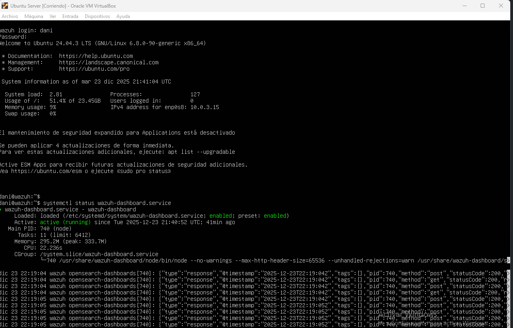
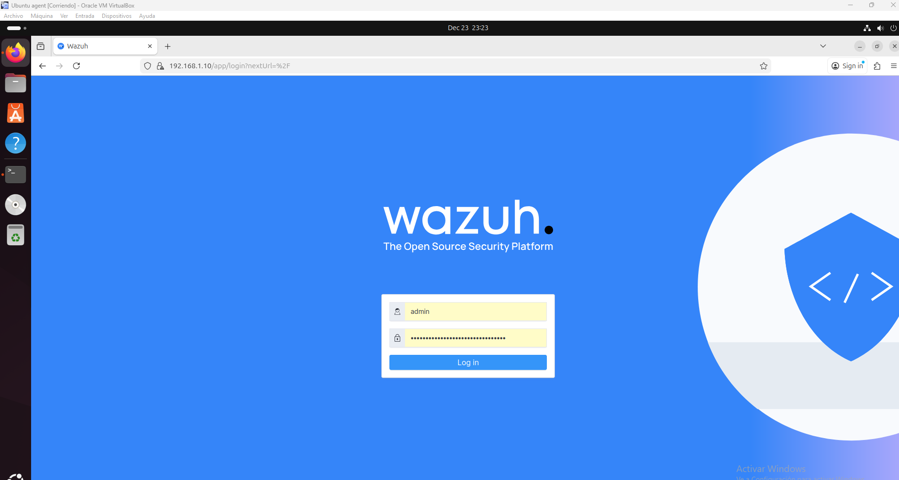

# Instalación de Wazuh Server (Manager) en Ubuntu

Este documento describe la **instalación del servidor Wazuh** siguiendo **el procedimiento automático oficial mediante script**, tal y como se indica en la documentación oficial de Wazuh.

La instalación se adapta a la siguiente topología:

* **Wazuh Server (Manager + Indexer + Dashboard)**: `192.168.1.10`
* **Agentes**: red `192.168.1.0/24`
* **Sistema operativo**: Ubuntu Server (20.04 / 22.04)

---

## 1. Descripción general

El **script automático de Wazuh** instala y configura:

* Wazuh Manager
* Wazuh Indexer (OpenSearch)
* Wazuh Dashboard

Todo el stack queda integrado y listo para recibir agentes sin necesidad de configuración manual adicional.

---

## 2. Requisitos previos

Antes de ejecutar el script, asegúrate de que el servidor cumple con:

* Ubuntu actualizado
* Acceso a Internet
* Al menos:

  * 4 GB de RAM (8 GB recomendado)
  * 2 CPU
  * 50 GB de disco
* Usuario con privilegios `sudo`
* IP estática configurada: `192.168.1.10`

Actualiza el sistema:

```bash
sudo apt update && sudo apt upgrade -y
```

---

## 3. Descarga del script oficial

Descarga el script de instalación oficial desde Wazuh:

```bash
curl -sO https://packages.wazuh.com/4.7/wazuh-install.sh
```

Asigna permisos de ejecución:

```bash
chmod +x wazuh-install.sh
```

---

## 4. Ejecución del script automático

Ejecuta el script en modo **instalación completa (all-in-one)**:

```bash
sudo ./wazuh-install.sh -a
```
---

## 5. Credenciales generadas

Al finalizar la instalación, el script mostrará por pantalla las credenciales del **Dashboard**:

* **URL**: `https://192.168.1.10`
* **Usuario**: `admin`
* **Contraseña**: *(generada automáticamente)*

En el caso de que se haya olvidado las creedenciales:

```bash
sudo tar -O -xvf wazuh-install-files.tar wazuh-install-files/wazuh-passwords.txt
```

---

## 6. Verificación de servicios

Comprobar que todos los servicios están activos:

```bash
sudo systemctl status wazuh-manager
sudo systemctl status wazuh-indexer
sudo systemctl status wazuh-dashboard
```
---

## 7. Acceso al Dashboard

Desde un navegador seaccede a:

```
https://192.168.1.10
```

Acepta la advertencia del certificado (autofirmado) e inicia sesión con las credenciales generadas.


---

## 8. Puertos utilizados

| Puerto | Protocolo | Servicio             |
| ------ | --------- | -------------------- |
| 1514   | TCP       | Comunicación agentes |
| 1515   | TCP       | Registro de agentes  |
| 55000  | TCP       | API Wazuh            |
| 9200   | TCP       | Indexer (interno)    |
| 443    | TCP       | Dashboard            |

---

## 9. Integración con agentes

Una vez instalado el servidor:

* El manager queda escuchando en `192.168.1.10:1514`
* Los agentes pueden registrarse mediante `manage_agents`
* Los eventos son visibles en el **Wazuh Dashboard**

---

## 10. Referencias

* Documentación oficial: [https://documentation.wazuh.com](https://documentation.wazuh.com)
* Script oficial: [https://packages.wazuh.com](https://packages.wazuh.com)

---
