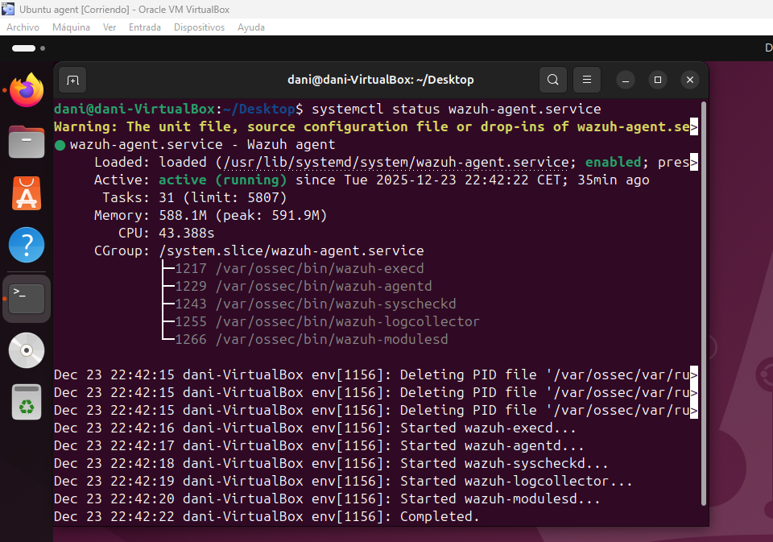
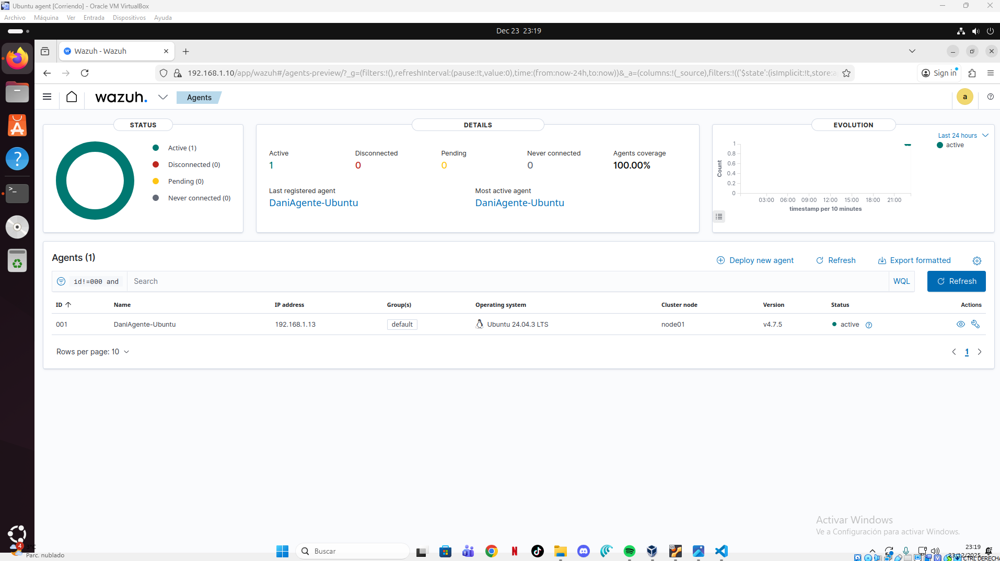

# Instalación del agente Wazuh en Ubuntu

Este documento describe el proceso de instalación y configuración del **agente Wazuh en Ubuntu**, siguiendo la **documentación oficial de Wazuh**, y adaptado a la siguiente topología de red:

* **Wazuh Manager**: `192.168.1.10` (Ubuntu)
* **Agente Wazuh (endpoint Ubuntu/Linux)**: `192.168.1.13`
* **Red**: `192.168.1.0/24`

---

## 1. Requisitos previos

Antes de instalar el agente, asegúrate de que:

* El sistema operativo del agente es **Ubuntu (20.04 / 22.04 o superior)**.
* El agente tiene conectividad IP con el **Wazuh Manager** (`192.168.1.10`).
* El puerto **1514/TCP** y **1515/TCP** están permitidos entre el agente y el manager.
* Se ejecutan los comandos como **root** o usando `sudo`.

Puedes comprobar conectividad con:

```bash
ping 192.168.1.10
```

---

## 2. Instalación del agente Wazuh

### 2.1 Añadir el repositorio oficial de Wazuh

Importar la clave GPG oficial:

```bash
curl -s https://packages.wazuh.com/key/GPG-KEY-WAZUH | sudo gpg --dearmor -o /usr/share/keyrings/wazuh.gpg
```

Añadir el repositorio:

```bash
echo "deb [signed-by=/usr/share/keyrings/wazuh.gpg] https://packages.wazuh.com/4.x/apt/ stable main" | sudo tee /etc/apt/sources.list.d/wazuh.list
```

Actualiza el índice de paquetes:

```bash
sudo apt update
```

---

## 3. Configuración e instalación del agente

Si vamos a la documentacion de wazuh nos muestra el comando para instalar el agente,
sustituyendo la ip del manager por la de nuestro server.

```bash
WAZUH_MANAGER="192.168.1.10" apt-get install wazuh-agent
```
---

## 5. Arranque y habilitación del agente

Inicia el servicio del agente:

```bash
sudo systemctl start wazuh-agent
```

Habilítalo para que arranque automáticamente:

```bash
sudo systemctl enable wazuh-agent
```

Comprueba el estado:

```bash
sudo systemctl status wazuh-agent
```


---
## 6. Verificación desde el Wazuh Manager

En el manager, valida que el agente está conectado:

```bash
sudo /var/ossec/bin/agent_control -lc
```

El agente debería aparecer como **Active**.

---


## 7. Puertos utilizados

| Puerto | Protocolo | Descripción                 |
| ------ | --------- | --------------------------- |
| 1514   | TCP       | Comunicación agente-manager |
| 1515   | TCP       | Registro de agentes         |

---

## 8. Notas adicionales

* El agente enviará logs del sistema, eventos de seguridad y métricas al Wazuh Manager.
* La visualización y análisis se realizan desde el **Wazuh Dashboard**.
* Cualquier cambio en `ossec.conf` requiere reiniciar el agente.

```bash
sudo systemctl restart wazuh-agent
```

---

## 9. Referencias

* Documentación oficial: [https://documentation.wazuh.com](https://documentation.wazuh.com)

---

