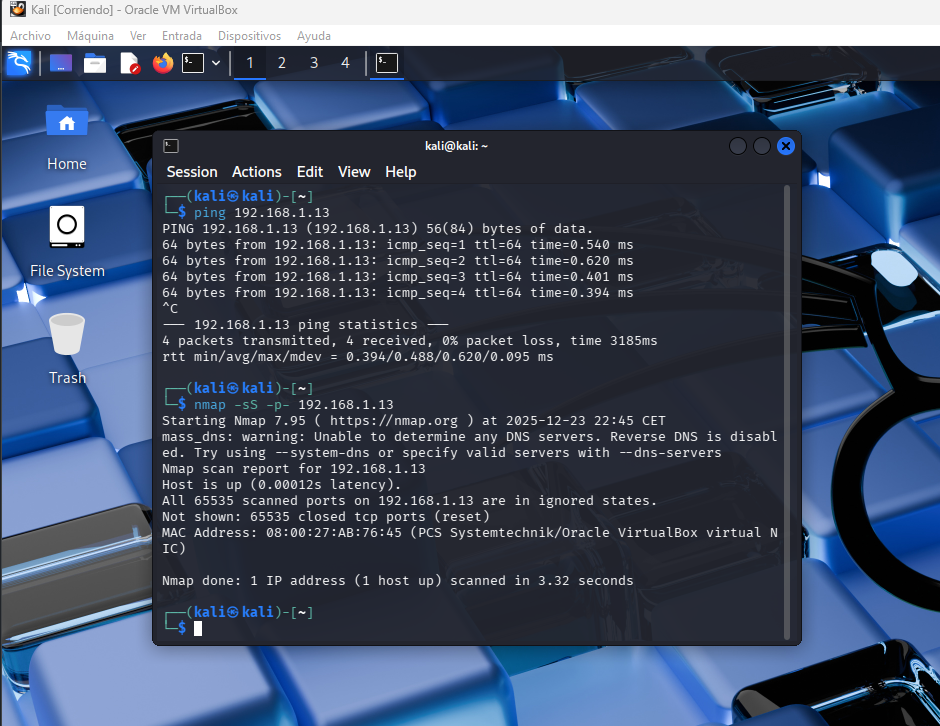

# Simulador de Ataques

Este documento describe el **simulador de ataques** utilizado en el laboratorio **Wazuh + Suricata**, cuyo objetivo es generar tráfico y eventos maliciosos controlados para evaluar la capacidad de detección, correlación y análisis desde una perspectiva **SOC**.

El simulador ha sido diseñado de forma **escalable**, permitiendo añadir nuevos tipos de ataques progresivamente a medida que el laboratorio evoluciona.

## Arquitectura del escenario de ataque

* **Atacante**: Kali Linux
* **Objetivo**: Agente Ubuntu (192.168.1.13)
* **Sistema de detección**:

  * Suricata (análisis de tráfico)
  * Wazuh (correlación y visualización)

```
[Kali Linux]
     |
     |  Tráfico malicioso simulado
     v
[Ubuntu Agent - 192.168.1.13]
     |
     v
[Wazuh Server - 192.168.1.10]
```

---

## Ataques simulados

Este apartado irá creciendo con el tiempo. Actualmente, el laboratorio incluye el siguiente ataque:

### 1. Escaneo de puertos con Nmap

#### Descripción

El escaneo de puertos es una de las técnicas más comunes en la fase de **reconocimiento** de un ataque. Permite al atacante identificar:

* Puertos abiertos.
* Servicios activos.
* Versiones de software expuestas.

En este laboratorio, el escaneo se realiza desde **Kali Linux** contra el **agente Ubuntu**, generando tráfico detectable por Suricata.

---

#### Ejecución del ataque

Desde Kali Linux se ejecuta el siguiente comando:

```bash
nmap -sS -p- 192.168.1.13
```


---
