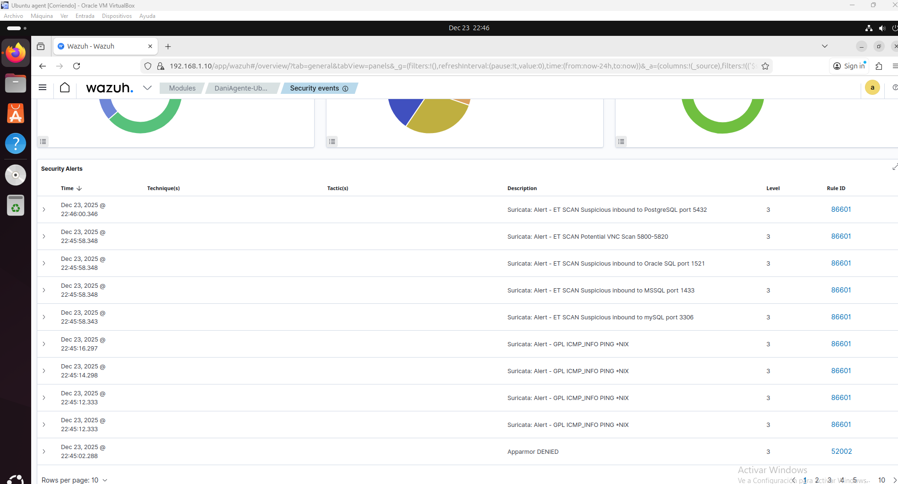
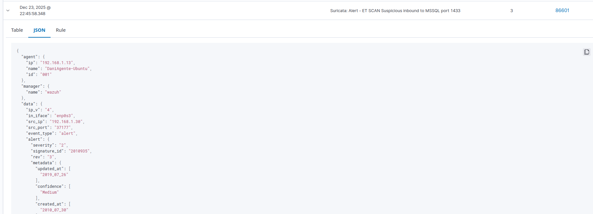

# DETECCION DE ALERTAS
Esta sección va enlacada con la simulación de ataque, es decir en anteriormente se realizan los ataques 
y aqui se muestra como quedan registrados en el dashboard

---

## Objetivo del simulador

* Generar eventos de seguridad reales y reproducibles.
* Evaluar la detección de Suricata como IDS.
* Analizar la correlación y alertas generadas en Wazuh.
* Practicar el flujo de trabajo de un analista SOC.

---
### 1. Escaneo de puertos con Nmap y ping

Una vez realizamos el ping y escaneo de puertos de Nmap vamos al dashboard de nuestro agente
y tendremos un registro de las alertas que este ha generado



Si entramos a la información de la alerta podemos encontrar información como:

* IP origen
* IP destino
* Puerto origen
* Puerto destino



Log entero:

```bash
{
  "agent": {
    "ip": "192.168.1.13",
    "name": "DaniAgente-Ubuntu",
    "id": "001"
  },
  "manager": {
    "name": "wazuh"
  },
  "data": {
    "ip_v": "4",
    "in_iface": "enp0s3",
    "src_ip": "192.168.1.30",
    "src_port": "37177",
    "event_type": "alert",
    "alert": {
      "severity": "2",
      "signature_id": "2010935",
      "rev": "3",
      "metadata": {
        "updated_at": [
          "2019_07_26"
        ],
        "confidence": [
          "Medium"
        ],
        "created_at": [
          "2010_07_30"
        ],
        "signature_severity": [
          "Informational"
        ]
      },
      "gid": "1",
      "signature": "ET SCAN Suspicious inbound to MSSQL port 1433",
      "action": "allowed",
      "category": "Potentially Bad Traffic"
    },
    "flow_id": "1811999145506718.000000",
    "dest_ip": "192.168.1.13",
    "proto": "TCP",
    "dest_port": "1433",
    "pkt_src": "wire/pcap",
    "flow": {
      "src_ip": "192.168.1.30",
      "src_port": "37177",
      "pkts_toserver": "1",
      "dest_ip": "192.168.1.13",
      "start": "2025-12-23T22:45:58.225280+0100",
      "bytes_toclient": "0",
      "bytes_toserver": "60",
      "pkts_toclient": "0",
      "dest_port": "1433"
    },
    "timestamp": "2025-12-23T22:45:58.225280+0100",
    "direction": "to_server"
  },
  "rule": {
    "firedtimes": 8,
    "mail": false,
    "level": 3,
    "description": "Suricata: Alert - ET SCAN Suspicious inbound to MSSQL port 1433",
    "groups": [
      "ids",
      "suricata"
    ],
    "id": "86601"
  },
  "decoder": {
    "name": "json"
  },
  "input": {
    "type": "log"
  },
  "@timestamp": "2025-12-23T21:45:58.348Z",
  "location": "/var/log/suricata/eve.json",
  "id": "1766526358.50426",
  "timestamp": "2025-12-23T21:45:58.348+0000",
  "_id": "OoctTZsBkF1hbzIVKdNK"
}
```
